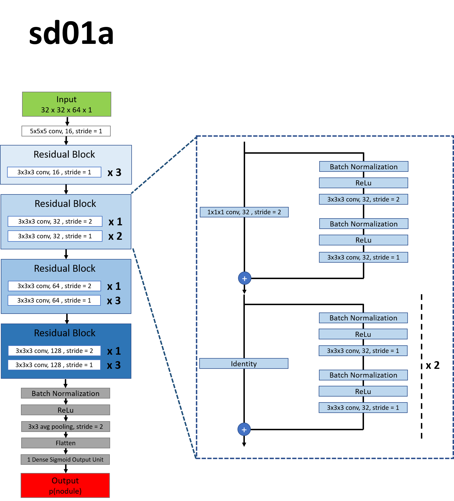
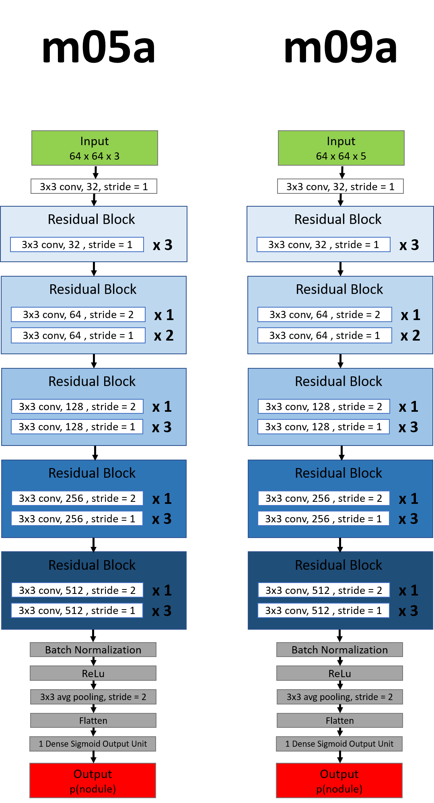
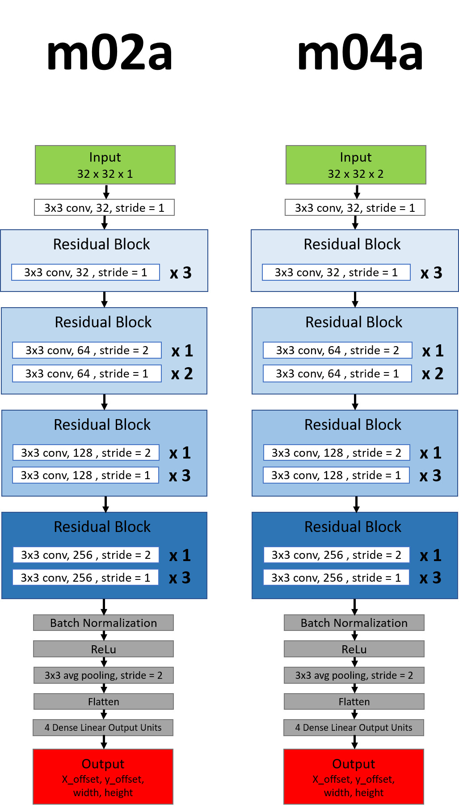
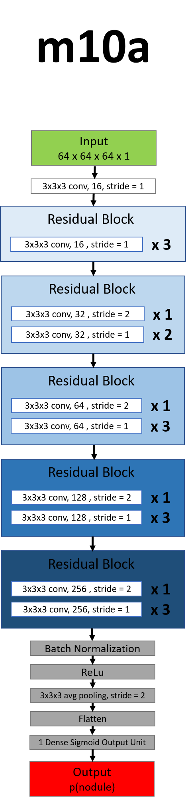
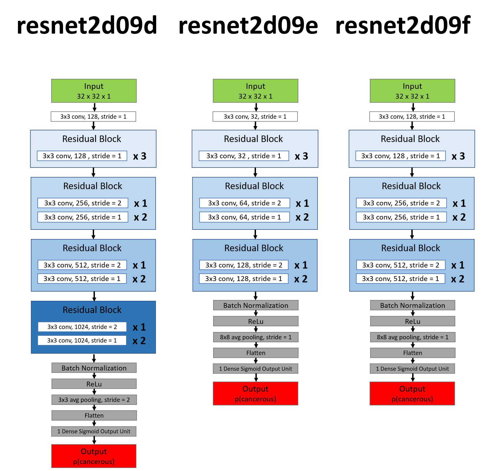

<!-- Add the algorithm's name as the title -->
# MDai Algorithm

## Summary
<!-- A brief (2-3 sentences) summary of the algorithm -->
An ensemble model based on multiple ResNets that create probability maps to detect nodules, which are further segmented 
by bounding boxes. The final prediction of whether the patient has lung cancer uses additional features including the sex 
of the patient and based on the detected nodules. The ensemble consists on a huge number of neural networks and will be 
quite expensive to run.

## Source
<!-- Where does the algorithm come from. If not a Data Science Bowl entry, adjust the template accordingly. -->
**Author:**  MD.ai  </br>
**Repository:**  https://github.com/mdai/kaggle-lung-cancer   </br>
<!-- Comment whether the algorithm was an entry to a challenge (e.g. Data Science Bowl) or similar. 
Also mention Placement. -->
6th place at the Kaggle Data Science Bowl 2017

## License
<!-- License the algorithm is under. -->

[Apache 2.0](https://www.apache.org/licenses/LICENSE-2.0)


## Prerequisites
<!-- summary on dependencies needed to run the algorithm -->

| Dependency |   Name   | Version  |
|------------|----------|----------|
| Language   | Python   | 3.5      | <!-- If not Python 3.5+ please describe steps to port into Python 3.5+ below -->
| ML engine  | Keras    | 1.2.2    | <!-- e.g. Keras -->
| ML backend | Tensorflow | 1.0.0  | <!-- e.g. Tensorflow -->
| OS         | Ubuntu   |  16.04   | <!-- Include all OS that were tested -->
| Processor  | CPU      | (yes/no) |
|            | GPU      | yes      |
| GPU driver | CUDA     | 8        |
|            | cuDNN    | 5.1      |


**Dependency packages:**
<!-- List dependency packages (e.g. numpy) with version. If using python use requirements.txt syntax for pip. That makes
 easy for the developers. -->
 
````
numpy==1.12.1
scipy==0.19.0
pandas==0.19.2
scikit-image==0.13.0
scikit-learn==0.18.1
joblib==0.9.4
pillow==4.0.0
xgboost==0.6a2
keras==1.2.2
tensorflow-gpu==1.0.0
hyperopt==0.1
h5py==2.7.0
redis-py==2.10.5
````

**Additional installation instructions:** 

Install pydicom 1.0.0a1 from source.
````commandline
git clone https://github.com/pydicom/pydicom.git pydicom-src
cd pydicom-src
git reset --hard bbaa74e9d02596afc03b924fe8ffbe7b95b6ff55
python setup.py install
````


## Algorithm design
<!-- Describe the model and its architecture in detail. -->

### Preprocessing
The DICOM images were preprocessed applying the following steps:

    1) DICOM images are loaded into a 3D-numpy ndarray. 
    2) The pixel values are converted into Hounsfield Units (HU).
    3) The volume is resampled to isotropic spacing.

### Sex detection
    
As a further feature for model training the sex is determined using a deep residual net (ResNet) with residual units 
based on the architecture proposed by [He et al.](https://arxiv.org/pdf/1603.05027.pdf) that was trained on hand-labeled 
DICOM images. The network architecture is as follows:



### Nodule detection

Two variants of ResNets are used to create two sets of probability maps out of the isotropic volume created from the DICOM 
image, that provide the further algorithm with regions of interest. This is done by extracting patches out of the full 
isotropic volume and using the model to predict the presence of a nodule in that patch. 
The model architectures are designed as follows: 



750 random hyperparameter sets are used in the further prediction process. These parameters include:

- Probability map of model m05a or m09a
- ResNet to fit boundary box
- ResNet to predict cancer probability
- Cancer Probability threshold
- Size threshold
- Number of nodules used in cancer prediction
- Inner or outer boundary box 
- Aggregation function for p(cancer)

A threshold is applied to the density map. Then for each configuration bounding boxes are 
fit around connected objects inside the probability map. A second ResNet is then used to refine the bounding boxes. 
These ResNets are designed as follows:



Too small bounding boxes are discarded. The remaining bounding boxes are used to create 3D image subsets out of the isometric
volume. These ROIs are again fed to the yet another ResNet to predict whether a nodule is present in it. This ResNet has 
 the following architecture:
 


ROIs with a too low probability to contain a nodule are discarded.

### Prediction of cancer probability

The ROIs remaining at the end of the nodule detection are fed into a third ResNet to predict whether they are cancerous or 
not. These ResNets is designed as follows:



The resulting probabilities are then aggregated. Further some additional features are created out of the geometry of the 
fitted bounding boxes, the number of ROIs and the number of predicted nodules.

All features (sex and nodule features) as well as the single probabilities that the patient has cancer resulting of all 
hyperparameter configurations are used in a XGBoost ensemble model to get a final prediction of how probable the patient 
has cancer.

## Trained model

A trained model is not publicly available, but was requested.

**Source:**  -   </br>

**Usage instructions:**  -   </br>

## Model Performance

### Training- / prediction time
<!-- If the specs of multiple test systems are known copy/paste the snippet below -->

**Test system:**  AWS p2.16xlarge instance   </br>

| Component | Spec  | Count |
|-----------|-------|-------|
| vCPU       | Broadwell 2.7 GHz |  64   |
| GPU       | NVIDIA GK210 |  16   |
| RAM       | 732 GB|       |

**Training time:**  Not specified. </br>
**Prediction time:** Several days for the whole DSB dataset. </br>

### Model Evaluation
<!-- State accuracy and other evaluation metrics for datasets the algorithm was tested on. -->

**Dataset:**    </br>

| Metric   | Score |
|----------|-------|
| LogLoss | 0.41629 |

## Use cases
<!-- List strengths and weaknesses of the algorithm. -->

### When to use this algorithm

 - If you want to take into account the patient's sex (only for final prediction, whether the patient has cancer.)
 - If you want bounding boxes for probable nodules.

### When to avoid this algorithm

 - A lot of models are run in parallel for one prediction. Thus this model will probably be computational very expensive.

 
## Adaptation into Concept To Clinic

### Porting to Python 3.5+
<!-- Comment on possible problems/solutions for porting the algorithm to Python 3.5+ -->
Already written in Python 3.5+.

### Porting to run on CPU and GPU
<!-- To be able to support a larger variety of systems, is it possible to make the model run on CPU and GPU? -->
Running it on a CPU has not been tested yet. It probably is possible, but the instructions given by the authors for running 
the pipeline on multiple GPUs will have to be adjusted.

### Improvements on the code base
<!-- What improvements on the code base can be made? (e.g. to increase performance, readability, etc.) -->

- There is basically no documentation (doc-strings, comments) to explain what the purpose of each function/module is.
- Some functions are extremely long and do a lot of stuff. Breaking them up in multiple functions will improve readability 
and maintainability.
- There are no unit tests so far.

### Adapting the model
<!-- What parts of the model are useful for the project? What changes could be made to make it more useful 
     for our product? -->
     
Since the goal of this project is to detect nodules and classify each nodule and not to predict whether the patient has cancer 
overall, the feature generation used for the ensemble model will not be needed, including the prediction of the patient's sex. 
The patient's sex would also probably be known by the doctor and does not have to be predicted in production.
The other parts of the prediction process up until the ensemble is happening can be used mostly unchanged. The final aggregation 
of the probabilities of cancer for each nodule has to be removed. Also the ensemble model will 
have to be adjusted to aggregate the predictions for each nodule of each hyperparameter combination instead of an overall probability
that the patient has cancer.
If possible the number of models in the ensemble should be reduced. The authors also suggest that some parts of the algorithm 
can be optimized.

## Comments
<!-- In this sections contributors can express their opinion on the algorithm -->
The model allows to identify and mark single nodules with bounding boxes, which would be great to label them for the user. 
It also calculates a cancer-probability for each nodule, which is useful for the goal of this project. But this model might be 
one of the most computational expensive ones and might not run on a PC.
The authoring team seems to recently have founded a startup (MD.ai) that wants to create solutions based on image recognition 
with deep learning on medical data. Thus they will probably hesitate to share the trained model.

## References
<!-- Links to the official documentation and other ressources referenced in this document -->
[Identity Mappings in Deep Residual Networks](https://arxiv.org/pdf/1603.05027.pdf)
