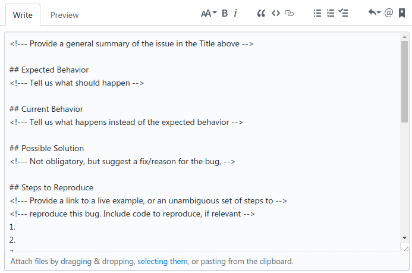

# Getting Started

Contributing is as easy as [submitting a PR to the GitHub repository](https://github.com/concept-to-clinic/concept-to-clinic)! If you're already a GitHub pro, you can get started just with the repo in the way you would with any open source project. If you're not sure how to get started:

 - [Sign up](/login) for the challenge
 - Find an [open issue you're interested in working on](https://concepttoclinic.drivendata.org/issues)
 - Get your local environment running with [the developer documentation](https://concept-to-clinic.readthedocs.io/en/latest/developing-locally-docker.html)
 - Submit your pull request to the [GitHub repo](https://github.com/concept-to-clinic/concept-to-clinic)

If you need any help, [jump into the forums](https://community.drivendata.org/c/concept-to-clinic) and ask away!

## Community Guidelines

This project is about building a community that is working together towards a shared goal. We've got a [code of conduct](/code-of-conduct) that we expect participants to respect, but it really boils down to:

 - **Keep the goal in mind.** We're focused on the audacious goal of providing advanced algorithms for clinicians. Points and prizes are great, but they're just a tool for keeping the project fun and interesting.
 - **Leave your ego at the door.** We're all aiming to achieve something bigger by working together.
 - **Practice empathy.** Not everyone has the same skills or background, assume participants have the best intentions.
 - **Encourage other participants.** The more people who can contribute the better for everyone. Help each other and recognize good work when you see it.
 - **Respect the process.** This project involves tricky technical tradeoffs. Sometimes the administrators may make a decision that you don't agree with. Contributors should assume good faith in all discussions and be willing to move on once the project moves past a certain decision.

And here are some concrete things that you can do:
 - Answer questions on the [forum](https://community.drivendata.org/c/concept-to-clinic)
 - Keep [the developer documentation](/documentation) up to date as you change code
 - See a good PR, add a +:heart: emoji! Challenge administrators will take notice.
 - Let others know when you're working on an issue—invite them to join your fork and solve it together!

## Making the Project Better

As with any open source project, the specification of how we reach our goals, the features that we implement, and how the software works will continue to evolve. We welcome your input in refining this vision.

We didn't think of everything beforehand, so contribute your ideas to the cause. We won't be able to implement every one, but filing good issues that become marked `official` after review will earn you points like a code contribution.

 - [Search the issues](https://github.com/concept-to-clinic/concept-to-clinic/issues) to make sure it doesn't already exist
 - Use the [issue template](#) to ensure all the relevant details are included
 - Wait for review and acceptance by the project maintainers

## Filing an issue

Creating issues is encouraged! When you create a new issue, you'll see a pre-populated template — please fill this out as carefully and thoroughly as possible. Vague or insufficient issues will be closed quickly to help keep the project on track.

Upon review, project admins may tweak the issue or ask for more clarification, or may attach the `official` label to demonstrate both agreement and that supplying a PR that closes the issue will result in an award of points.

## Opening a Pull Request

It's beyond the scope of this document to explain pull requests in detail, but Github has some great [resources](https://help.github.com/articles/creating-a-pull-request/) to help people new to git and Github.

Once you're familiar with the concept, the steps are pretty simple:

- Fork the `concept-to-clinic/concept-to-clinic` project
- Clone your own fork to your local development computer
- Check out a branch in your local repo, named something descriptive like `issue-8-sphinx-autodoc`
- Make your changes
- If necessary, rebase the changes onto the project's `master` branch
- Open the PR, and fill out the prepopulated PR template to the best of your ability
