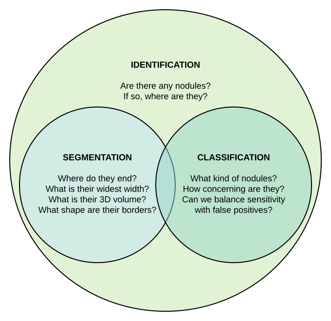
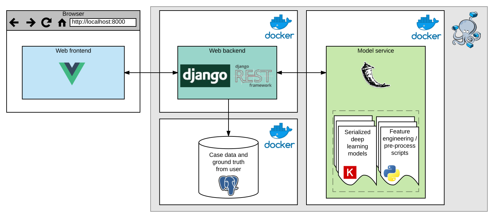
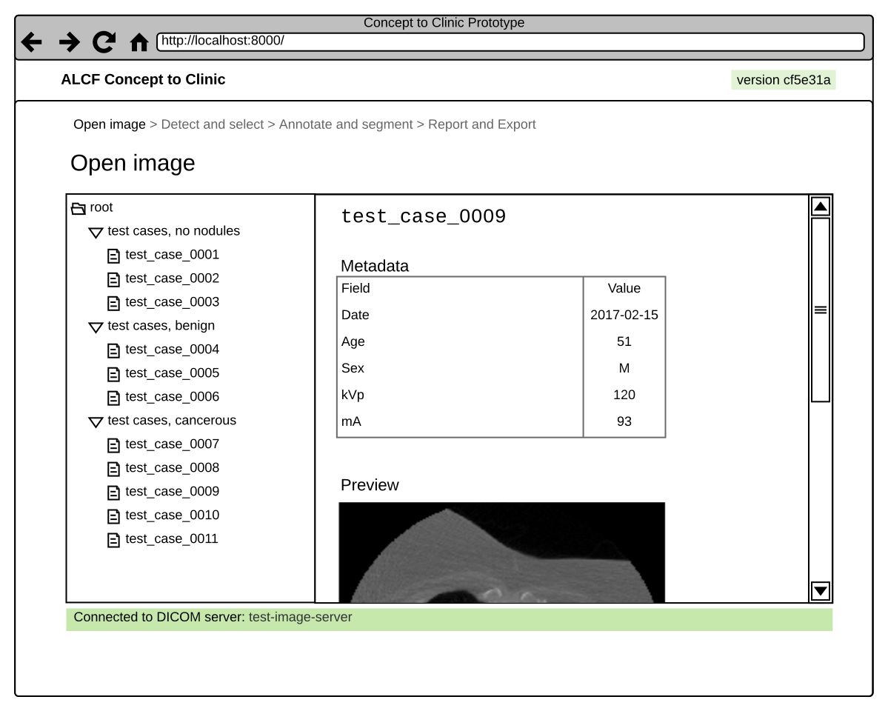
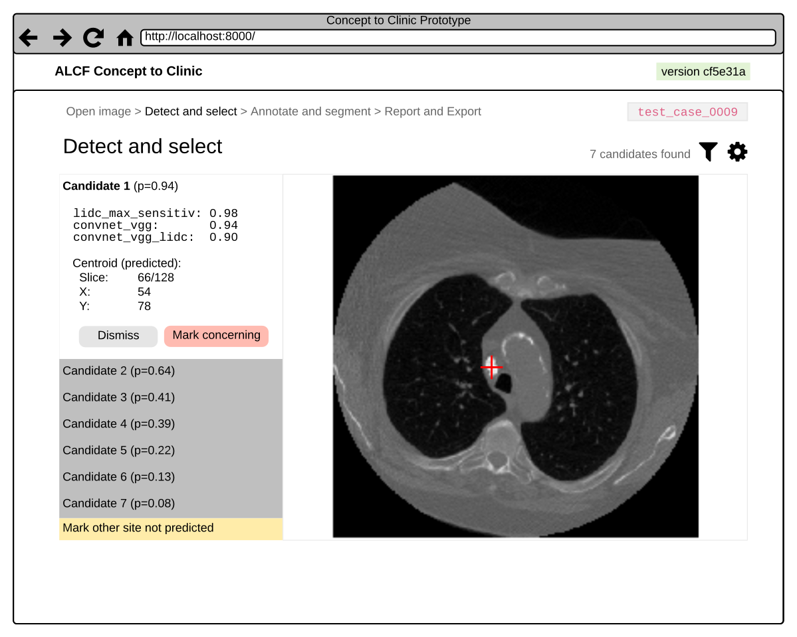
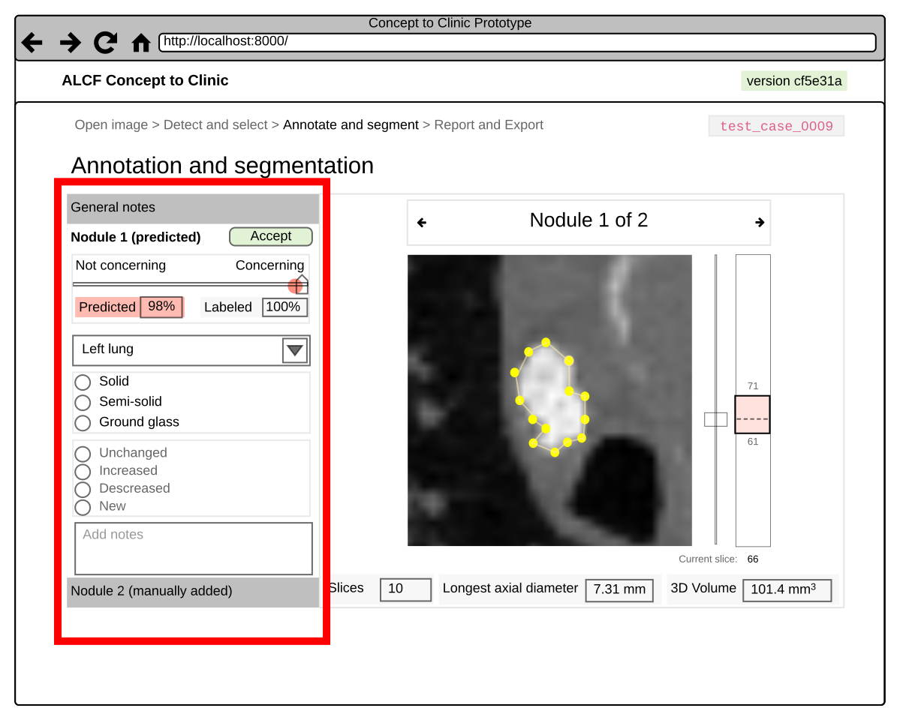
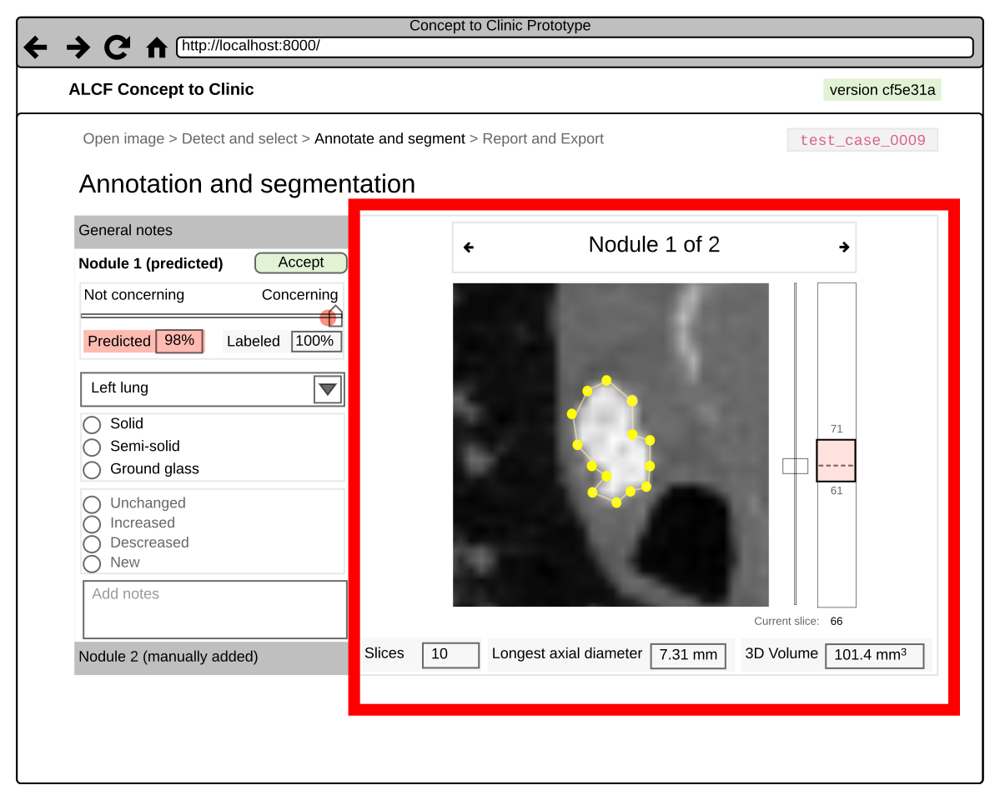
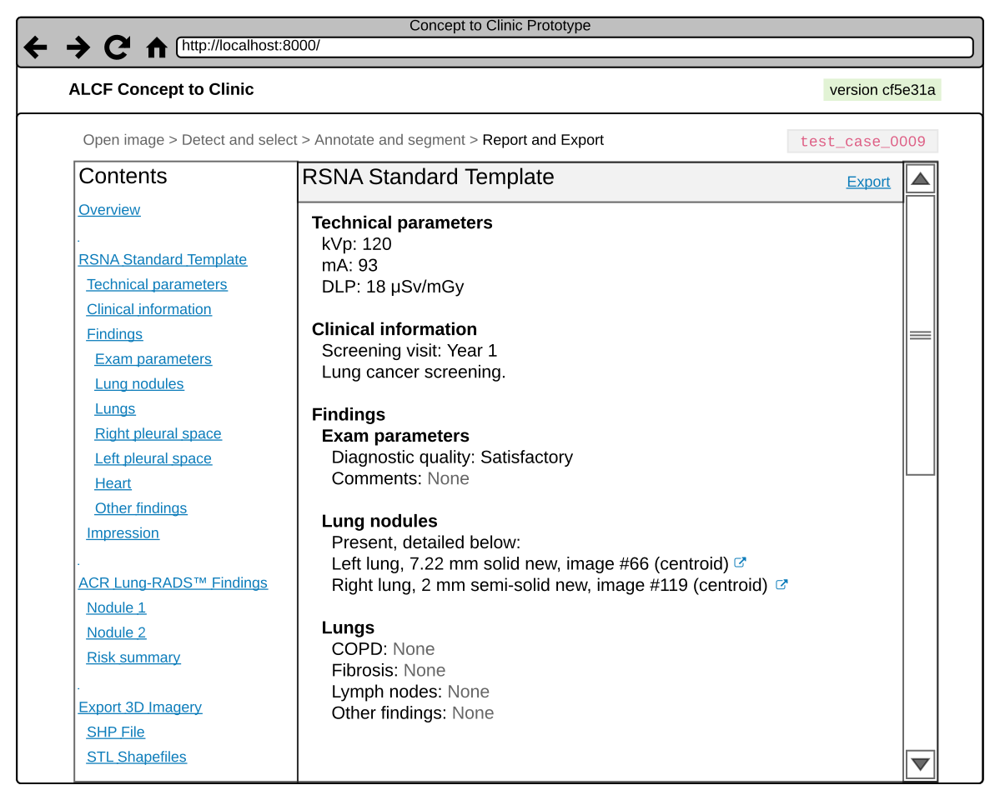

ALCF Concept to Clinic Design Document
======================================

Introduction
------------

### User story: how to think about this software

Bob is 55 years old. He goes to his family doctor for a routine checkup.
The family doctor notes that Bob fits the right diagnostic profile for
getting a lung cancer early screening scan. Bob’s doctor schedules him
for a low dose computed tomography (LDCT) scan at a teaching hospital
down the street. Bob goes to this appointment a few days later where a
technician helps him into the computed tomography (CT) machine and then
captures imagery of his chest cavity.

Dr. Smith is a chief resident in diagnostic radiology at the hospital
where Bob’s scans were taken, and works in a lab that conducts
experimental research using new technologies and treatments. She is an
experienced and competent professional with years of experience making
diagnoses using standard Picture Archiving and Communication System
(PACS) software.

Still, like most radiologists she acknowledges that there is an art to
detection and diagnosis and that if several other radiologists examined
the same CT scans they might all reach slightly different conclusions.

She also knows that computer aided detection (CADe)/computer aided
diagnosis (CADx) technology has been advancing rapidly and she’s open to
using an easy-to-use tool that will help her do her job more
efficiently.

Dr. Smith has just pulled up Bob’s imagery in order to review and
interpret the imagery that the CT scanner generated. In front of Dr.
Smith are two computers:

-   To the left is her ordinary hospital workstation running a standard
    PACS software package. This is a system she uses every day, and she
    is extremely practiced at using this software; ever since starting
    residency, she has used some similar version of PACS software nearly
    every day. The PACS software is a highly specialized and fully
    featured software suite geared towards making it easy for clinicians
    to explore imagery. For instance, the user can pan around the image,
    zoom in and out of specific areas, scroll up and down the Z axis
    through image layers, change image brightness and contrast, and
    measure lengths between points.

-   To the right is a standalone laptop. The software from this project
    is running locally on a fresh Linux install, and a browser window is
    opened on the homepage of the web-based interface service. This
    computer is trusted and only has intranet access to the DICOM
    imagery server.

**The key question is this: armed with recent developments in artificial
intelligence and machine learning, how might we help Dr. Smith catch
cancer early and give her patients a better chance of having more time
with their families?**

Here are some issues in the current PACS diagnosis workflow that Dr.
Smith feels could be improved upon:

-   Radiologists don’t want to miss any spots with potentially
    concerning tissue.The current software is great at presenting
    imagery but doesn’t adequately help detect nodules.
-   Radiologists worry a lot about false positives because exposing
    patients to additional CT scan radiation or unnecessary surgical
    procedures carry risks of their own and can end up being more
    dangerous than the original nodules. The current software doesn’t
    adequately help minimize false positives.
-   The more accurately a nodule is measured, the more accurate
    the diagnosis. Right now, most radiologists just eyeball which slice
    looks like it has the widest diameter. Then they use the measuring
    tool to take one horizontal measurement in the direction that
    looks widest. This method is imprecise and results in a loss of
    useful information when a complex 3D shape having volume and surface
    features is reduced to a single estimated width. Additionally, not
    knowing the precise nodule boundaries also means it’s difficult to
    quantify whether and how a nodule has changed over time. The absence
    or presence and characteristics of such change over time is a major
    cancer indicator for radiologists. So the current software doesn’t
    adequately help measure nodule boundaries.
-   There is an existing set of best practices for what should be
    included in a lung cancer screening report (i.e. RSNA Standard
    Template For Lung Cancer
    Screening, http://www.radreport.org/template/0000268). Most
    radiologists haven’t adopted this standard yet, partially because
    it’s a lot of work and partially because the tools aren’t helpful in
    filling this out. The current software doesn’t help radiologists
    organize their thoughts or automatically annotate the records in
    ways that conform with best practices, so it doesn’t adequately help
    streamline reporting.

### Goals and scope

This application can be thought of as a prototype in the research and
development (R&D) phase that is closely focused on building and
presenting features that are **novel** and **build or improve upon
existing tools** for lung cancer CADe/CADx. To borrow terms from “The
Lean Startup,” this application will serve as a minimum viable product
(MVP) from which we can quickly gather feedback from radiologist users.

> A minimum viable product is the "version of a new product which allows
> a team to collect the maximum amount of validated learning about
> customers with the least effort" — “The Lean Startup” by Eric Ries,
> 2014

In this MVP, we are focusing on three core predictive **task areas**:

-   `IDENTIFICATION`: Analyze CT scan images to detect and pinpoint the
    location of concerning nodules from background tissue.
-   `CLASSIFICATION`: Use what we've seen from nodules in the past to
    predict whether the identified nodules are cancerous or benign.
-   `SEGMENTATION`: Find the boundaries of nodules and create automatic
    measures to help radiologists refine and build out the
    computer-aided diagnosis.
    

We are also focusing on three ancillary but useful task areas:

-   `IMPORTING`: Going from DICOM formatted images on disk (or, ideally,
    available through a server process that mimics the DICOM servers
    in hospitals) and (1) loading these DICOM images into a data format
    that is useful for analysis, e.g. Numpy array, and (2) persisting
    these imported data structures to a central location for access by
    various services. For the purposes of this project we will simply
    use the local filesystem to which all processes will have access,
    but in the future this file abstraction could easily be extended to
    cover cloud storage or network files.
-   `REPORTING`: Present what has been found in a concise and clinically
    useful format that corresponds to identified best practices (such as
    the RSNA standard template) and evidence based risk diagnosis tools
    (such as the Lung-RADS™ assessment methodology).
-   `EXPORTING`: Allow results to be exported in a variety of sensible
    formats which ideally fit existing standards, align with real world
    usage, or at least would be easy to repurpose in other applications.

### Non Goals

For this proof of concept, we only want to spend time on value-added
features that advance the core research and development efforts of the
project. In order to focus work solely on things that are important, it
helps to explicitly outline what’s not in scope for this project.

Here’s one important non-goal: we are **not** trying to recreate the
features of a production PACS system. Millions of dollars and many
engineer years have been spent creating commercial off-the-shelf (COTS)
software that lets radiologists explore imagery in a fast, native
application; PACS is a solved problem that we’re not tackling here.

The goal is also certainly **not** to create a HIPAA-compliant,
cloud-ready SaaS app completely with enterprise-grade security, load
balancing, SSL certificates and so forth. In other words, this project’s
scope entails running on a local, trusted computer in a research clinic
authorized to use non-standard applications. That means the app does not
have to be ready to run in a public venue or with complicated security
and privacy controls; the reasoning is not that this tool could never be
put in production in such a system, it’s just that productionizing an
app for privacy, security, user workflow, and so forth are all (1)
largely solved problems, (2) highly specific to the application setting,
and (3) not relevant to this project’s R&D focus.

So while a limited set of features common to PACS systems or SaaS
applications may incidentally need to be built or incorporated if it
improves our ability to demonstrate core capabilities, the following
features are examples of things that aren’t relevant or do not fit
within the scope of this R&D effort unless user feedback indicates
otherwise:

-   User authentication, including password resets and transactional
    emails
-   Role based access control or file access controls
-   Service discovery and sophisticated container orchestration
-   Most types of production-centric optimization like page caching
-   Native or GPU accelerated exploration of CT images

### Design goals and architecture

It’s important to remember that the overarching goals is for this
project is that the models are (1) useful, and (2) able to be adapted
and adopted for use in hospitals with as little modification as
possible. By adopting a hypothesis-driven development model and
incorporating iterative product releases and validated learning in
accordance with the Lean Startup principles, we can achieve our
development goals more efficiently and with reduced risk of failure.

Let’s imagine that somebody is creating a plugin that recreates our
functionality on an existing COTS PACS system. Our goal is not to
replace PACS, just to build on it, so this would be a great outcome.
Such an implementation of this prototype would not use this software
unmodified — indeed, it would use the existing PACS frontend which is
unlikely to be web-based. So even though our interface will demonstrate
what is possible, it needs to be **loosely coupled** to the trained
models which are doing the core predictive tasks.

In order to preserve a bright line separation of concerns, we’ll break
the overall application down into several constituent pieces. Here’s an
extremely high level view of the component hierarchy:

-   The job of the **prediction service** (via the **trained models**
    it wraps) is to implement these core predictive tasks and expose
    them for use, respectively. The models themselves shouldn’t need to
    know about the prediction service which in turn should not need to
    know anything about the interface application.

-   The job of the **interface backend (API)** is to ferry data back and
    forth between the client browser and model service, handle web
    requests, take care of computationally intensive transformations not
    appropriate for frontend Javascript, and persist user-entered data
    to a data store. It should not need to know much about the interface
    frontend, but it’s main job is to relay data for frontend
    manipulation so it’s acceptable for this part to less abstractly
    generalizable than the prediction service.

-   The job of the **interface frontend (UI)** is to demonstrate as much
    value as possible by exposing functionality that the models make
    possible in an intuitive and attractive format. Each of these jobs
    to be done is described in greater detail below.

Here’s a visual representation of this architecture:

Jobs to be done
---------------

### Imagery selection

Task areas: `IMPORTING`

#### Imagery - Prediction service

RESERVED

#### Imagery - Interface API

1.  List available DICOM images on local filesystem.
2.  Display such details as may be available (e.g. metadata) for any
    particular DICOM image set on local filesystem.
3.  Return a preview of the DICOM image on local filesystem as an
    HTML-displayable image.
4.  Allow a specific image to be selected and create a new “Case” to
    work on for the remainder of the steps.
5.  Items 1-3, but connecting to a DICOM server running in a
    separate container.

#### Imagery - Interface frontend

1.  List available DICOM images on local filesystem.
2.  Display such details as may be available (e.g. metadata) for any
    available DICOM image.
3.  Display a preview of an available DICOM image.
4.  Allow user to select a given image and start a new “Case.” This
    image will be used in the identification step next.

### Detect and select

Task areas: `IDENTIFICATION`, `CLASSIFICATION`

#### Detect - Prediction service

1.  Given a pointer to a DICOM image on the local filesystem, generate a
    response with an array of predicted nodules (“candidates”). Each
    candidate in the response should indicate the centroid location
    tuple (X \# voxels from left, Y \# voxels from top, Z as slice
    number), and P(concerning) that each model outputs for each
    predicted location. Parameters that the request may include are a
    threshold for minimum P(concerning) to include a candidate in the
    response, and (2) a specific list of which models to use.
2.  If multiple models are used to make predictions, combine and
    deconflict the predictions in a useful way. For example, if each of
    the models comes up with a slightly different set of candidates
    (which is to be expected), try to figure out if candidates that are
    close together are duplicates or bona fide separate
    tissue locations. If this approach has some tunable
    sensitivity (e.g. tweaking a distance threshold at which candidate
    sites are assumed to be the same nodule) then look for such a
    parameter in the model request.
3.  Items 1 and 2, but accept an appropriate URI as the pointer to a
    DICOM image and implement fetching so that a DICOM server running in
    a separate container may be used in place of the local filesystem.

#### Detect - Interface API

1.  Act as the data broker for the image being worked on (selected in
    our current session), requesting predictions from the Prediction
    service along with filtering or other passed parameters and relay
    them back to the frontend.
2.  Provide an endpoint that can receive a payload of all nodule
    locations, (1) nodule centroid location tuple (X \# voxels from
    left, Y \# voxels from top, Z as slice number), (2) whether the
    nodule was predicted or manually added, and (3) whether the nodule
    was marked for further analysis or not (those manually identified by
    the user are presumably concerning). Persist this location list to
    the database attached to the current Case.

#### Detect - Interface frontend

1.  List all available predicted candidate sites. Allow each to be
    selected to view details.
2.  When a candidate is selected, show a detail view in an image
    viewer control. By default, show the slice containing the predicted
    centroid and a marker clearly indicating where the predicted
    centroid occurs.
3.  Allow the user to zoom, pan, and navigate through slices in the
    image viewer.
4.  Allow the user to [window grayscale levels](https://radiopaedia.org/articles/windowing-ct).
5.  Allow the user to toggle the candidate centroid marker’s visibility.
6.  Allow the user to mark any predicted candidate for further analysis.
7.  Allow the user to navigate through the imagery freestyle and mark
    other locations which the models missed.
8.  When the user has finished marking candidates, send all of this
    labeled data to the backend in the format specified above.

### Annotate

Task areas: `CLASSIFICATION`, `REPORTING`

#### Annotate - Prediction service

RESERVED

#### Annotate - Interface API

1.  List nodules identified as part of the current Case for detail view.
2.  Receive and persist to the database a radiologist-supplied label for
    how concerning each nodule actually is.
3.  Receive and persist to the database the other fields expected for
    each case in the RSNA Radiology Reporting Template for CT Lung
    Cancer Screening (http://www.radreport.org/template/0000268) — for
    example, solid/semi-solid/ground glass consistency, left lung/right
    lung, and any freehand notes they entered in the text box.
4.  Receive and persist to the database the other fields expected for
    each nodule in the RSNA Radiology Reporting Template for CT Lung
    Cancer Screening. Namely: a choice between left lung/right lung; a
    choice between solid, semi-solid, and ground glass; a choice between
    unchanged/increased/decreased/new; and a field for text entry
    of notes. These should all be persisted to the database.

#### Annotate - Interface frontend

1.  Provide UI controls for adding sending general RSNA template notes
    for the case.
2.  Provide UI controls for selecting a nodule for detail view for a
    single nodule and display that nodule in a corresponding
    image viewer.
3.  In the detail view for a single nodule, provide a UI control for
    specific a user-supplied ground truth label for P(concerning). Also
    show an indication of what the predicted P(concerning) was for
    each nodule.
4.  In the detail view, provide UI controls for the nodule specific RSNA
    template data outlined above.
5.  In the detail view, enrich the image viewer with pan, zoom, and
    slide traversal for taking a closer look at and around nodules.

### Segment

Task areas: `SEGMENTATION`

#### Segment - Prediction service

1.  Given a nodule centroid location tuple (X \# voxels from left, Y \#
    voxels from top, Z as slice number), return a 3D boolean mask with
    true values for voxels associated with that nodule and false values
    for other tissue or voids.

#### Segment - Interface API

1.  For any given slice of any given nodule, transform the true values
    in the binary mask from the Prediction service into a series of
    vertices defining an irregular polygon which can be displayed on
    the image. In the transformation to vertices, take a precision
    parameter which causes the transformation to use more or fewer
    vertices to make the polygon fit the binary mask more precisely.
2.  Given a stack of such irregular polygons, calculate a number of
    summary statistics of interest, to include: a new estimated centroid
    location tuple (X \# voxels from left, Y \# voxels from top, Z as
    slice number); a volume in cubic millimeters; a longest
    axial diameter.
3.  Provide an endpoint that allows the current vertices to be persisted
    to the database attached to the current Case and Nodule.
4.  Provide an endpoint that allows a 3D visualization of each nodule to
    be provided in a static image format (.png).
5.  Provide an endpoint that allows a 3D visualization of each nodule to
    be viewed in an interactive format.

#### Segment - Interface frontend

1.  Display an image view of a given slice of the selected nodule. Allow
    navigation between slices.
2.  Overlay the current vertices on top of the nodule image to see the
    predicted boundary.
3.  Allow the user to move existing vertices.
4.  Allow the user to delete existing vertices.
5.  Allow the user to add a new vertex splitting a line segment
    connecting two vertices.
6.  Allow the user to extend the nodule boundary along the Z axis by
    extending the currently terminal polygon up or down to the adjacent
    slice which still has unhighlighted nodule.
7.  Indicate to the user the Z axis extent of slices.

### Results

Task areas: `REPORTING`, `EXPORTING`

#### Results - Prediction service

RESERVED

#### Results - Interface API

1.  Summarize all of the data from the Case, including the general
    notes, and details for each nodule into a single JSON report.
2.  Allow export of the whole report as an Extensible Markup
    Language (.xml) file.
3.  Allow export of the whole report as a Portable Document
    Format (.pdf) file.
4.  Allow export of the whole report as a Microsoft Word
    document (.docx) file.
5.  Allow export of 3D nodule reconstructions in STL format.
6.  Allow export of 3D nodule reconstructions in SHP format.

#### Results - Interface frontend

1.  Display all of the results from the case matching the RSNA format in
    a clean, organized, and hyperlinked report.
2.  Display the results
3.  Provide links to all of the export options in sensible locations
    throughout the report.

